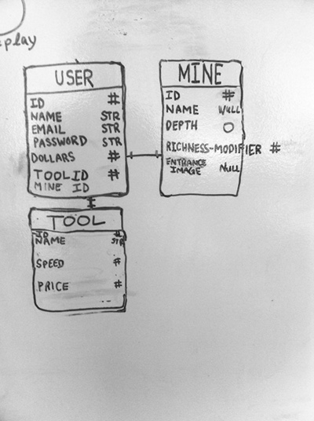
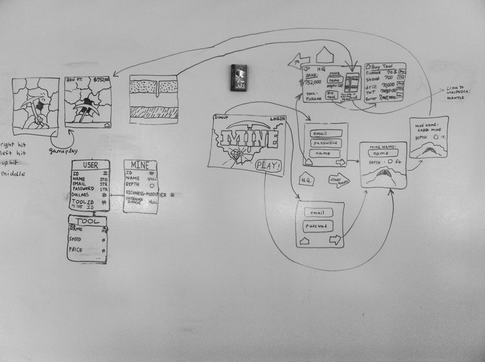
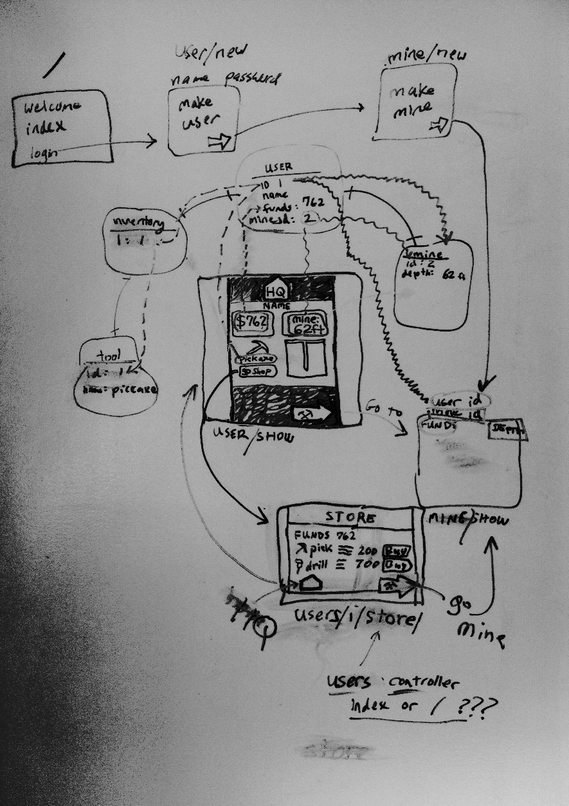

#MINER

##By Gabe Snyder

###TABLE OF CONTENTS:
* overview
* concept
* process
* technical details
* known bugs and issues
* future features to add
* technologies used
* 'user stories'
* resources
* source code
* live game example (heroku)
* contact

###OVERVIEW:
Miner is a web game written in JavaScript and Ruby, on Rails.
It was created over one week in July as part of the Web Development course at General Assembly School in Washington, DC, USA.

The objectives include:
* Implement a server-side application with a database.
* Implement a client-side application with JavaScript.
* The server-side and client-side communicate via Ajax.
* The user interface has presentable design and user experience.
* The project is complete and showable.

###CONCEPT:
I chose to create a web game because I thought it would be challenging, have scaleable complexity, and allow me to make something off-beat and fun!

I wanted to try and use artistic choices such as including atomspheric sound and adhering to a specific color palette, to get the most effect possible from my software and technical choices, which were to include save-able gameplay, WebGL and Pixi js 2d graphics, and more traditional-feeling web-page style stats and store pages.

###PROCESS:
My process for developing a MVP (minimum viable product - the simplest version of something that can at least illustrate functionality) for the game was as follows:

* Brainstorm game ideas
* Draw some quick mock-up wireframes, images or concept-holders. This step can remove ideas which dont have a clear plot or flow potential.
* Turn this mock-up into a full wireframe (drawings of each screen, indicating its outgoing-links with lines).
* Add an ERD (an Entity Relationship Diagram shows how the conceptual entities within the game, ie. usually things which need a database table of their own, relate to one another) with relationships between database and pages also indicated (I add these db-page relationships to make it easier for me later!).
* Write `user stories` (break the ideal user experience down into bite-size intentions, ie."The landing page has a button to log-in", which can be acted upon to drive development.)
* Revise Wireframe and ERD to user-story specs.
* Read a lot of Phaser docs.
* Code a rudimentary game-state, (which is what I call the gameplay view, where a user can actually mine, ie. see a miner sprite mining), using Phaser (Phaser is a js library for games, which uses Pixi js and WebGL for rendering graphics.)
* Use rails to create a Database.
* Create my models, in rails.
* Create custom routes for certain game actions.
* Put up a 'stats' view in rails, which links to the gamestate.
* Make database data available to the gamestate, through it's rails controller.
* write a simple gameplay view using Phaser and JS, with one sprite (the animation of an action occurring)
* Put up the rest of the views, with corresponding controllers.

At this point, a user could log in, log out, create a mine, 'mine' to gain points and mine-depth, and buy a tool at the store with their points-- but there were no sprites for different tools, no sounds, no pictures, no textures.

* Create more game sprites
* Add final styles to views with css
* Add ambient sounds to page views, and for certain specific actions, such as swinging a pickaxe or buying a new tool.

A this point, my initial development sprint concluded. See the future-features section for functionality I'd like to include in the future.

###TECHNICAL DETAILS:

Entity-Relationship Diagrams from development:

Game Wireframes:

Final working  verion of ERD/wireframe:

###TECHNOLOGIES USED:

* Ruby 2.1.1
* Rails 4.1.1
* javaScript
* Phaser js 2.0 (game graphics/logic library)
* jQuery
* underscore.js
* html
* css

###KNOWN BUGS AND WEAKNESSES:

* Ive noticed that the gameplay view can take a moment to load initially, while certain large sprites and graphics are loaded to the users brower. This could be inproved in the future by not loading sprites which will not be used during that session--they currently all load for every session, even though only one tool can be used per session.

* The gameplay view should have security measures implimented, as it is potentially (very) possible for a user to enter a different users mine.

* The store purchase alert will sometimes display the incorrect item, saying 'you purchased a shovel!' when you actually purchased a drill. The correct price is deducted and correct item assigned to inventory, however.

###FUTURE FEATURES / FIXES:

* complete sprites for all tools.
* resolve float rounding issues game-wide
* resolve hall-of-fame ranking/sorting irregularities
* add custom sounds for shovel, drill, powerdrill and borer
* allow collaborative mining?
* add copy describing how to mine (which keys)
* interactive mine wall, that falls, crumbles and changes.
* clouds of smoke while mining
* mine-progress bar rescaled to show depth in relative feet, compared to known onjects (empire state building, etc)
* wikipedia links appear to topics, such as 'mantle'
* copy on landing page, deascribing concept of the game.

###USER STORIES:

* https://trello.com/b/OteRK3ll/miner-user-stories

###RESOURCES:

* http://rubyonrails.org/
* http://phaser.io/

###SOURCE CODE:

github:

* https://github.com/Gabe888/Miner

###LIVE GAME EXAMPLE:

heroku:

* http://miner-game.herokuapp.com/

###CONTACT INFO:

gsnydermail ( at ) gmail ( dot ) com

====THANKS!====
